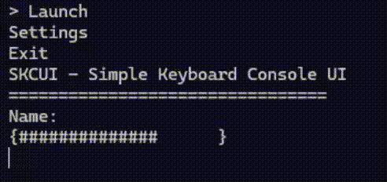

# SKCUI — Simple Keyboard Console UI



A small, header-only C++ library for keyboard-driven console menus, checkboxes, text input, and progress bars.

**SKCUI** stands for **Simple Keyboard Console UI**. It includes Windows, Linux, and macOS input implementations without requiring a separate library build.

## Requirements

- C++20 or newer for the current component API (the bundled CMake example uses C++23)
- C++17 or newer for the stable 1.x function API
- An interactive Windows, Linux, or macOS terminal
- ANSI support for the current API's default screen clearing, or `SKCUILEGACYCONSOLE` for command-based clearing

## Choose a package

| Package | API | C++ standard |
| --- | --- | --- |
| [Stable](release/stable/README.md) | `component::Menu`, `component::Checkbox`, and composable add-ons | C++20+; bundled CMake example uses C++23 |
| [Stable 1.x](release/stable%201.x/README.md) | `skcui::menu` and `skcui::checkbox` functions | C++17+ |

Both packages include their own header, example, setup guide, and license. Development takes place in `dev/skcui.hpp`.

## Quick start

Copy `release/stable/src/skcui.hpp` into your project or add `release/stable/src` to your compiler's include path:

```cpp
#include "skcui.hpp"
#include <iostream>

int main() {
    skcui::component::Menu menu{{"Start", "Exit"}};
    menu.add(skcui::component::Text{"Choose an option."});
    menu.add(skcui::component::Input{"", "Name: "});

    skcui::display::render(menu);

    if (menu.selected >= 0 &&
        menu.selected < static_cast<int>(menu.options.size())) {
        std::cout << "Highlighted: " << menu.options[menu.selected] << '\n';
    }
}
```

Use Up/Down to navigate through options and input fields. Type to edit the focused input and use Backspace to delete. Enter on a menu option returns; Escape closes the UI. Checkboxes use Enter to toggle and Escape to return.

Text, separators, blank lines, input fields, and progress bars can be appended with `add`. See the [API reference](docs/api.md) for stored input values, checkbox state, and progress-bar usage.

## Build the bundled example

From the repository root in an x64 Visual Studio Developer Command Prompt:

```bat
cl /nologo /std:c++20 /EHsc /W4 /I release\stable\src release\stable\examples\full-example.cpp /Fe:skcui-example.exe
```

Or use the bundled CMake project (CMake 3.20+ and a C++23 compiler):

```sh
cmake -S release/stable/examples -B build/stable
cmake --build build/stable --config Release
```

For the C++17 package:

```bat
cl /nologo /std:c++17 /EHsc /W4 /I "release\stable 1.x\src" "release\stable 1.x\examples\full-example.cpp" /Fe:skcui-1x-example.exe
```

## Repository layout

- `assets/` — demo GIF
- `dev/skcui.hpp` — development header
- `release/stable/` — current component API and full example
- `release/stable 1.x/` — C++17 function API and full example
- `docs/` — current API reference and historical release notes

See the [release index](release/README.md) for package details.

## Documentation

- [Current API reference](docs/api.md)
- [Stable setup guide](release/stable/README.md)
- [Stable 1.x setup guide](release/stable%201.x/README.md)
- [Stable 1.x API reference](release/stable%201.x/docs/api.md)

## License

SKCUI is available under the [MIT License](LICENSE).
